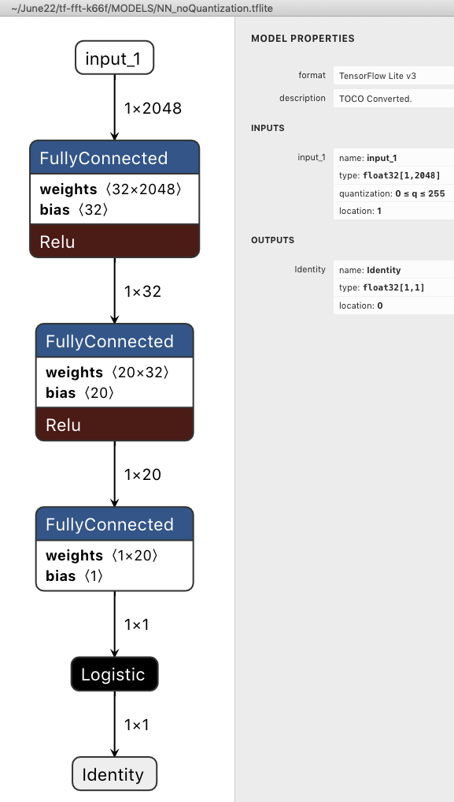
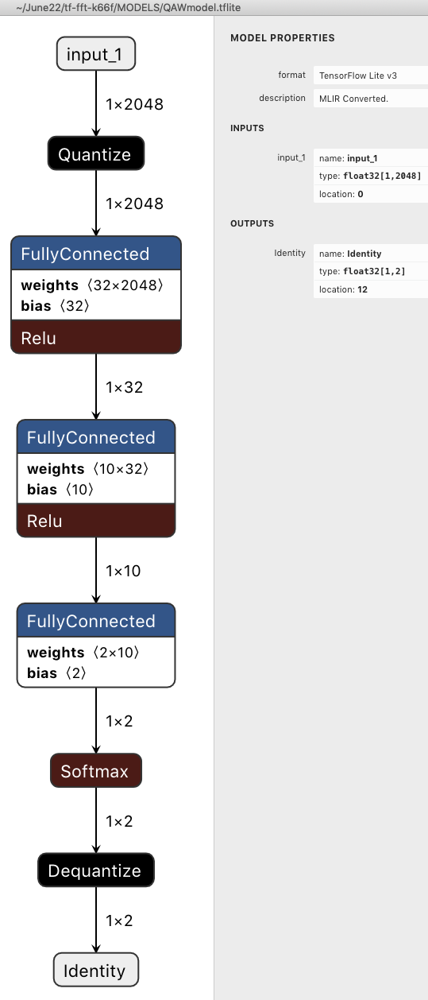

## TFLite CMSIS FFT FRDM-K66F  audio

### Convert tflite to .cc
xxd -i your_model.tflite > model.cc


### Compile  and deploy to board
```
mbed compile --target K66F --toolchain GCC_ARM -DMODEL=1 --profile release --flash --sterm --baudrate 115200
```

To pass the model name to gcc use -DMODEL=...
E.g.:
```
-DMODEL=1    - for NN_noQuantization (Logistic Regression)
-DMODEL=2    - for QAWmodel (Softmax and Quantizatioj)
```
### Types supported by tensor
```
typedef enum {
  kTfLiteNoType = 0,
  kTfLiteFloat32 = 1,
  kTfLiteInt32 = 2,
  kTfLiteUInt8 = 3,
  kTfLiteInt64 = 4,
  kTfLiteString = 5,
  kTfLiteBool = 6,
  kTfLiteInt16 = 7,
  kTfLiteComplex64 = 8,
  kTfLiteInt8 = 9,
  kTfLiteFloat16 = 10,
  kTfLiteFloat64 = 11,
} TfLiteType;
```
### Model with Logistic Regression


### Model with Quantization and Softmax




